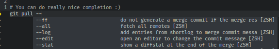
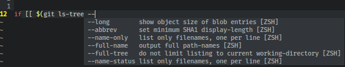

# coc-zsh

coc.nvim source for Zsh completions

You can install the normal way you install vim plugins:

```
Plug 'tjdevries/coc-zsh'
```

## Examples

Works with lots of commands (if you have completion for them)




Works with aliases!


Works with complex commands!




Note: I think this only works on Linux :smile:. I've only tested on Ubuntu 18.04
